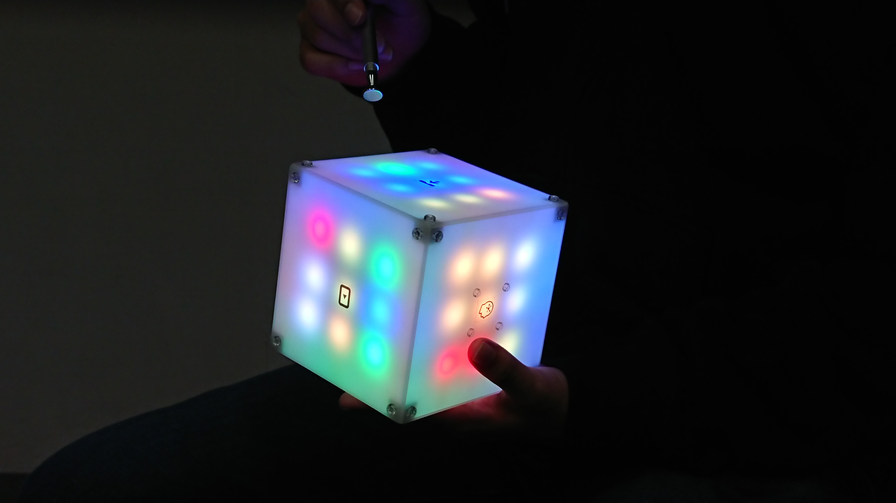
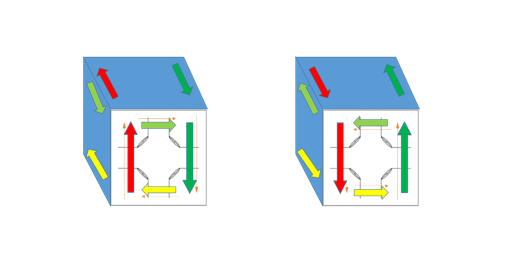
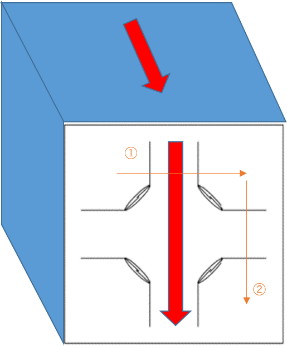
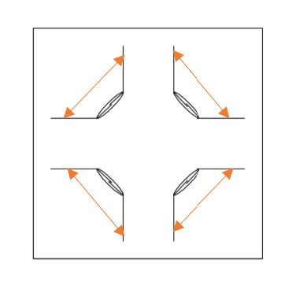

# ElectronicCubePuzzle

## ElectronicCubePuzzleとは
1マスの色をRGBフルカラーLEDで表現した，光るルービックキューブです。  
コンピュータがルービックキューブを解く自動解答機能や保存機能など，通常のルービックキューブにはできない機能を搭載しています。

LEDの光を主役としたきれいで楽しいデバイスを作りたいと考え，LEDキューブに着想を得て製作しました。

ルービックキューブとして，生活を彩るイルミネーションとして，あなたの生活に遊びと彩りをお届けします。
## 機能説明
### 通常操作
通常のルービックキューブと同じように端の列を回転させます。  
物理的に回転するのでは無く、本体の表面を専用のペンで図の細い矢印のようになぞることでLEDのパターンが変移します。  
  
### 中央列操作
中央の列を回転させます。
こちらも通常操作と同じように，本体表面を専用のペンで図の細い矢印のようになぞることでLEDのパターンが変移します。  
  
### 特殊操作
ElectronicCubePuzzleは各面に1つ，計6個の特殊機能を搭載しています。  
どの面にどの機能が割り振られているかはアイコンで確認できます。   
指定の面の表面の角いずれかを専用のペンで専用のペンで図の細い矢印のようになぞることで各機能を呼び出すことができます。 

1. 輝度・音量調節     
LEDの明るさ・音のオンオフを組み合わせた5つのプリセットを機能呼び出しするたびに変更する。

2. シャッフル         
ルービックキューブのマスをランダムで設置する。

3. 自動解答           
コンピュータが自動でパズルを解く機能。  
実際に解いている様子をLEDのアニメーションで表す。

4. セーブ             
ルービックキューブのマスの状態を保存する。

5. ロード             
セーブした状態に戻す。

6. イルミネーション   
シャッフルと自動解答を繰り返し実行する。  
イルミネーション中に機能再呼び出しで終了する。
ただ一定のパターンで光るイルミネーションでは無く、実際にルービックキューブを解いている様子が見れるロマン機能。

